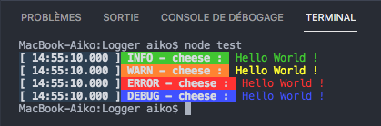

# Logger

A simple configurable Logger for log everything easily.

## Features

- Create several loggers with different names
- Configure timezone and time format (12 hours or 24 hours)
- Write logs into a file if you want
- Write logs in console if you want
- Choose log format and log color type
- Enable or not color in console

## Screenshots



## Installation

Run :
```npm
npm install @leixydev/logger --save
```

## Documentation
*Coming soon..*

## Usage

```js
const { Logger } = require('@leixydev/logger');
const logger = new Logger({
  loggerName: 'myLogger',
  timezone: 'Europe/Paris',
  timeFormat: 24, // 24 or 12
  outDirFile: {
    enabled: true,
    path: './logs/' 
  },
  outDirConsole: {
    enabled: true,
    colored: true
  },
  logFormat: 1, // format of the log : [DATE] LABEL - loggerName : message or LABEL [DATE] | loggerName - message
  colorType: 'background' // background or font
});

logger.info('Information..');
logger.error('Error..');
logger.warn('Warn..');
logger.debug('Debug..');
```
